# AML-BRE Demo

A portfolio-safe demonstration of an Anti-Money Laundering (AML) detection workflow. The project shows how deterministic transaction-pattern rules can be combined with a supervised machine-learning model, evaluated on labeled synthetic data, and used to prioritize new transactions for investigation.

> This repository is an educational portfolio project. It contains no employer data, credentials, production configurations, customer information, or confidential business logic.

## Problem

AML teams need to identify suspicious activity across large transaction populations while preserving explainability for investigators. A useful prototype must support both:

- transparent pattern rules, such as Many-to-One, One-to-Many, Mule Account, and Dormant Account activity;
- a data-driven model that learns how those signals relate to known alerts;
- reviewable predictions, rule contributions, and reproducible validation.

## Approach

1. Generate synthetic transactions with known training labels or unlabeled scoring data.
2. Engineer graph- and behavior-oriented rule features.
3. Train a class-balanced logistic regression pipeline on labeled data.
4. Learn the operating probability threshold from validation data by maximizing F1.
5. Score new transactions and expose prediction probability, alert status, and dominant rule contribution.
6. Present the workflow in a Streamlit interface and retain CSV export for review.

## Architecture

```mermaid
flowchart LR
    UI[Streamlit AML Studio] --> INGEST[CSV upload or synthetic generator]
    INGEST --> FE[Rule feature engineering]
    FE --> TRAIN[Labeled training data]
    TRAIN --> MODEL[StandardScaler + LogisticRegression]
    MODEL --> PARAMS[Learned coefficients and F1 threshold]
    PARAMS --> SCORE[Score new transactions]
    SCORE --> EXPLAIN[Rule contributions and dominant rule]
    EXPLAIN --> REVIEW[Investigator review and CSV export]
```



See [docs/architecture.md](docs/architecture.md) and [docs/methodology.md](docs/methodology.md).

## Data Required

Training and scoring CSV files require:

| Column | Meaning |
| --- | --- |
| `sender_account` | Originating account identifier |
| `receiver_account` | Receiving account identifier |
| `amount` | Transaction amount |
| `transaction_date` | Parseable transaction timestamp |
| `alert` | Required only for training; binary ground-truth indicator |

The included files under `data/` are synthetic and intentionally small enough to inspect. Do not place real customer or employer data in this repository.

## AML Rules

- **Many-to-One:** counts unique senders funneling into a receiver.
- **One-to-Many:** counts unique receivers paid by a sender.
- **Mule pair:** aggregates amount for a sender/receiver pair.
- **Dormancy gap:** measures time since the sender's prior transaction.

These are screening signals, not conclusions of criminal activity. They require investigation and appropriate governance.

## ML and Explainability

The model uses a class-balanced logistic regression pipeline because it is appropriate for tabular screening data and supports coefficient-level interpretation. Standardization makes rule features comparable. The validation split is stratified, and the probability threshold is learned from validation predictions rather than hard-coded.

For each scored row, the model provides:

- `prediction_probability`
- `prediction`
- standardized linear contribution for each rule
- `top_rule_contributor`
- `top_rule_contribution_score`

The current synthetic labels are deliberately simple and are not evidence of production performance. See [docs/governance.md](docs/governance.md) for limitations and controls.

## Run Locally

```powershell
python -m venv .venv
.\.venv\Scripts\Activate.ps1
pip install -r requirements.txt
python src/aml_core/generate_sample_data.py --num_transactions 5000 --data_type training --transactions_file training_rules.csv
python src/aml_core/generate_sample_data.py --num_transactions 1000 --data_type new --transactions_file new_rules.csv
python src/aml_core/ml_model.py
python run_app.py
```

The web app provides three steps: generate data, train/review the model, and score/review new transactions.

## Tests and Notebook

```powershell
pytest
```

The walkthrough notebook at [notebooks/aml_workflow.ipynb](notebooks/aml_workflow.ipynb) demonstrates generation, rule features, training, evaluation, and scoring without relying on confidential data.

## Results and Improvement Opportunities

On the included synthetic sample, the workflow produces measurable precision, recall, F1, a confusion matrix, learned rule coefficients, and scored output. These results demonstrate plumbing and observability, not real-world effectiveness.

A production-quality implementation would add temporal out-of-time validation, calibrated probabilities, stronger labels from reviewed cases, population stability monitoring, fairness testing, case-management integration, analyst feedback loops, model versioning, and independent model-risk review.

## What I Would Do Differently

- Build labels from adjudicated investigations rather than deriving them from transaction amount.
- Compute features using an as-of timestamp to prevent temporal leakage.
- Use account-level and network-level windows instead of full-dataset aggregates.
- Compare interpretable baselines with tree-based and anomaly-detection challengers.
- Define alert-volume and false-positive objectives with compliance stakeholders before tuning thresholds.
- Add data contracts, lineage, access controls, drift monitoring, and documented approval gates.
