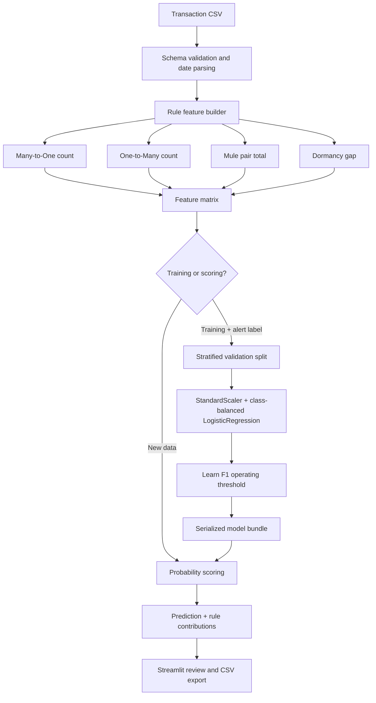

# Architecture

## Components

## Boundaries

- `src/aml_core/aml_rules.py` owns deterministic rule features and screening rules.
- `src/aml_core/ml_model.py` owns preprocessing, training, threshold selection, scoring, persistence, and explainability.
- `src/ui/streamlit_app.py` owns user interaction and visual review.
- `data/` contains synthetic examples only; `models/` and `outputs/` are runtime locations.

The model bundle contains the fitted pipeline, feature names, learned coefficients, reference levels, and evaluation summary. In a production system this would also carry dataset identifiers, code version, training timestamp, approval status, and lineage metadata.
